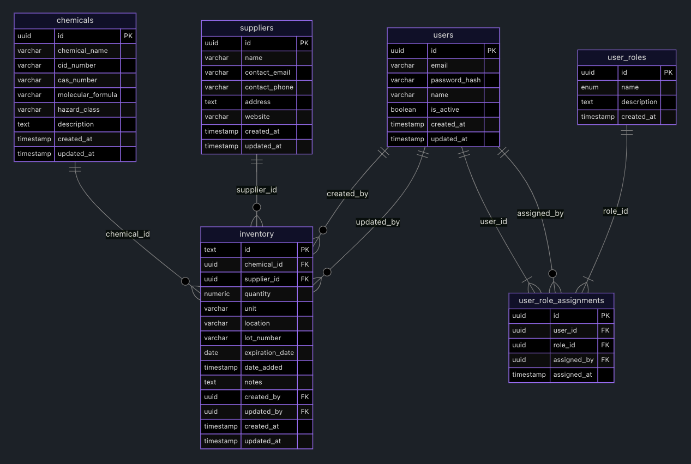

#  Chemical Inventory Lite

## Overview
Chemical Inventory Lite is a lightweight web application designed to help manage chemical inventories efficiently. [See the demo](https://chemical-inventory-lite.netlify.app/).

## Tech Stack
| Technology       | Description                          |
|------------------|--------------------------------------|
| React            | Frontend framework for building UI components |
| Neon PostgreSQL  | Serverless PostgreSQL database for data persistence |
| Express.js       | Backend API for CRUD operations on Neon PostgreSQL database |
| Tailwind CSS     | Utility-first CSS framework for styling |
| Radix UI         | React components for accessible UI patterns |
| lucide-react     | React integration for Lucide icons    |
| next-themes      | Theme toggle integration for React    |

### Data Storage
This application uses **Neon PostgreSQL** for persistent data storage with a normalized relational schema across six tables:

**Core Tables (Active):**
- `chemicals` - Chemical compound information (name, CAS number, hazard class, molecular formula)
- `suppliers` - Supplier contact details (name, email, phone, address, website)
- `inventory` - Inventory items linking chemicals and suppliers with quantities, locations, and tracking

**Authentication Tables (Future Use):**
- `users` - User accounts with email, password hash, and activation status
- `user_roles` - Role definitions for permission management
- `user_role_assignments` - Mapping users to roles for access control

**Database Schema Overview:**


**Relationships:**
- Each `inventory` item references one `chemical` and one `supplier`
- Inventory tracks `created_by` and `updated_by` users (currently uses default user ID)
- Users can be assigned multiple roles through `user_role_assignments`
- Foreign keys ensure referential integrity across related tables

The database connection is configured via environment variables for security and flexibility across environments.

## Installation
1. In terminal, clone the repository: `git clone https://github.com/jphdevsf/chemical-inventory-lite`
2. Navigate to the directory: `cd chemical-inventory-lite`
3. Install dependencies: `npm install`
4. Create a `.env` file in the root directory with:
   ```
   VITE_API_URL=/data
   DATABASE_URL=[neon db url]
   DEFAULT_USER_ID=[some id, arbitrary for now]
   ```
   Replace `your_neon_database_url` with your actual Neon connection string from the Neon dashboard.

## Commands
- `npm run build`: Build the application
- `npm run dev`: Start development server
- `npm run lint`: Lint the codebase
